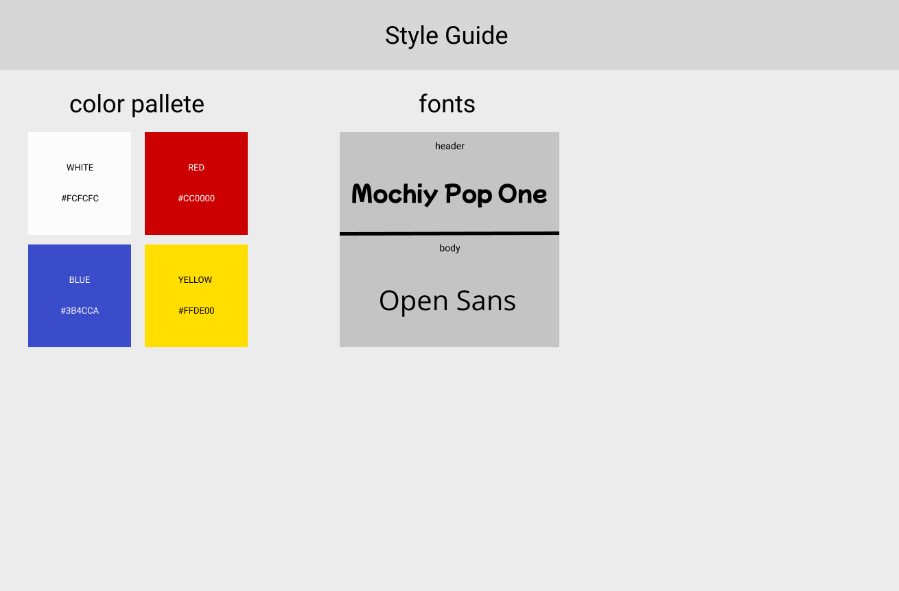

<h1 align="center" >
 PokeInventory
</h1>

## schema

## style guide

<!-- TODO fix colors -->

## Site Map

### learned

##### winston

- use of the logger winston (transports, levels)
- put logger config in seperate file

##### mongoose

- validate function on schemas allow for each value in an array to be checked
- created custom logic to populate db with pokeapi data

##### bash

- learned the basics of bash scripting
  - loops, conditional statements, varibles

##### git

- learned how to create a branch on a branch (git branch [child branch] [parent branch])

##### css

- custom font path src is relative to the css file
- learned mixins and loops to reduce duplicate code and increase modularity
