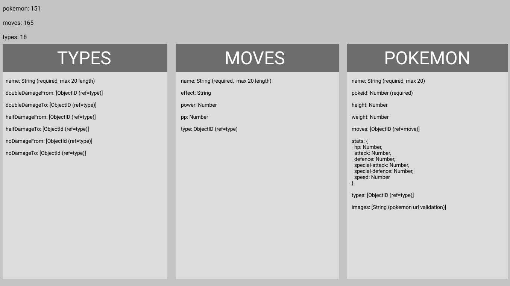
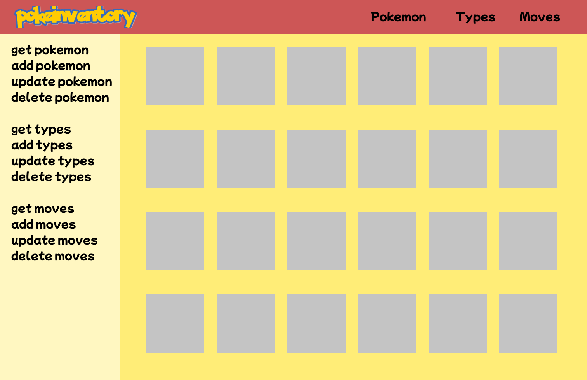

# poke inventory

#### schema

#### style guide

#### home page

### learned

##### winston

- use of the logger winston (transports, levels)
- put logger config in seperate file

##### mongoose

- validate function on schemas allow for each value in an array to be checked
- created custom logic to populate db with pokeapi data

##### bash

- learned the basics of bash scripting
  - loops, conditional statements, varibles

##### git

- learned how to create a branch on a branch (git branch [child branch] [parent branch])
